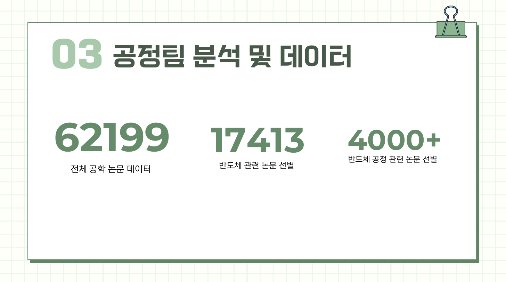
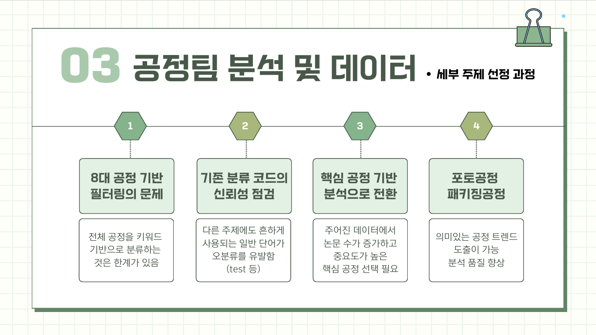
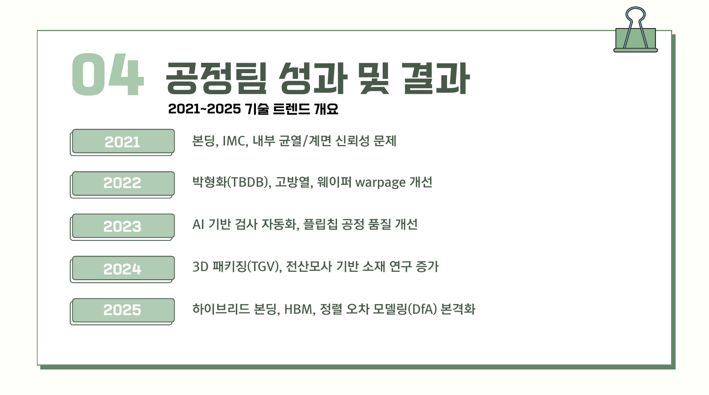
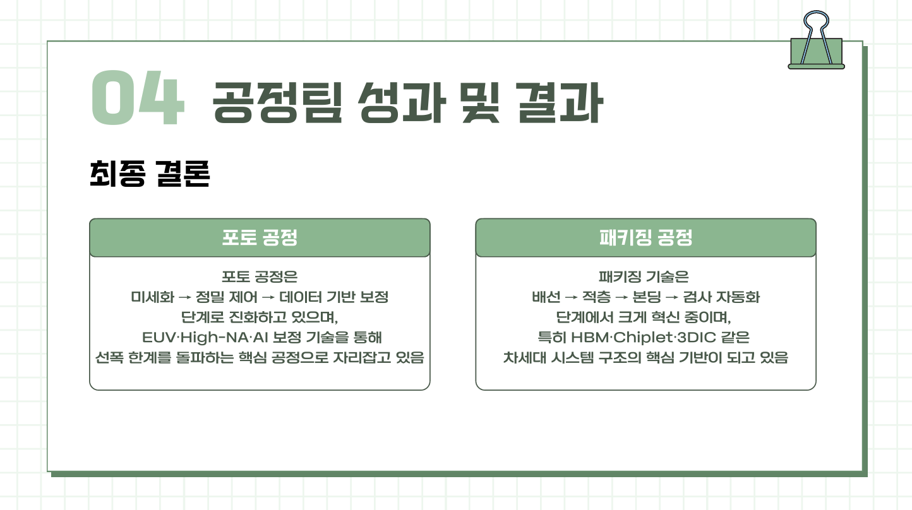
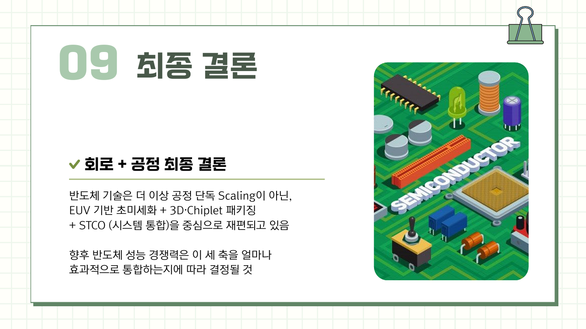

# SSU Datathon 2025 — Semiconductor Technology Trend Analysis

<p align="center">
  <b>
    Python 기반 62,199건 공학 논문 분석을 통한<br>
    반도체 공정·회로 기술 트렌드 도출
  </b>
</p>

<p align="center">
  
  
  
  
  
</p>

---

## Project Summary

본 프로젝트는 **SSU 데이터톤 2025**에서 수행한 반도체 연구 트렌드 분석 프로젝트입니다.

2021년부터 2025년까지의 공학 논문 **62,199건**을 Python으로 분석하여 반도체 관련 논문을 선별하고, 공정과 회로 분야의 핵심 연구 흐름을 분석했습니다.

초기에는 반도체 8대 공정을 모두 키워드로 분류하고자 했지만, `test`와 같은 일반 단어가 반도체 테스트 공정과 무관한 논문까지 포함시키는 오분류 문제를 발견했습니다.

이에 기존 분류 체계를 그대로 유지하지 않고, 키워드의 기술적 고유성과 산업적 중요도를 고려하여 다음 두 공정을 중심으로 분석 전략을 재설계했습니다.

- Photolithography
- Advanced Packaging

### Key Results

| Analysis Stage | Number of Papers |
| :--- | ---: |
| 전체 공학 논문 | 62,199 |
| 반도체 관련 논문 | 17,413 |
| 반도체 공정 관련 논문 | 4,000+ |
| 최종 핵심 공정 | Photolithography, Advanced Packaging |

<p align="center">
  
</p>

<p align="center">
  <sub>62,199건의 공학 논문에서 반도체 및 공정 관련 논문을 단계적으로 선별했습니다.</sub>
</p>

---

## Contents

1. [Project Information](#1-project-information)
2. [My Contribution](#2-my-contribution)
3. [Problem Definition](#3-problem-definition)
4. [Analysis Pipeline](#4-analysis-pipeline)
5. [Classification Failure and Strategy Refinement](#5-classification-failure-and-strategy-refinement)
6. [Process-Team Analysis](#6-process-team-analysis)
7. [Circuit-Team Analysis](#7-circuit-team-analysis)
8. [Cross-Domain Findings](#8-cross-domain-findings)
9. [Technical Implementation](#9-technical-implementation)
10. [Data and Reproducibility](#10-data-and-reproducibility)
11. [Scope and Limitations](#11-scope-and-limitations)
12. [Documentation](#12-documentation)
13. [Weekly Activity Logs](#13-weekly-activity-logs)
14. [Repository Structure](#14-repository-structure)
15. [Key Takeaway](#15-key-takeaway)

---

# 1. Project Information

| Item | Description |
| :--- | :--- |
| Competition | SSU Datathon 2025 |
| Team | 신전탐험대 |
| Period | 2025.12–2026.01 |
| Team Size | 4 members |
| Analysis Period | Academic papers published from 2021 to 2025 |
| Original Dataset | 62,199 engineering papers |
| Main Domains | Semiconductor Process and Circuit |
| Process Topics | Photolithography, Advanced Packaging |
| Main Tools | Python, pandas, Jupyter Notebook |
| Outputs | Filtered datasets, notebooks, weekly reports, final presentation |

## Team Structure

| Member | Major | Role |
| :--- | :--- | :--- |
| **송민호** | Materials Science and Engineering | **Team Leader / Process Team / Advanced Packaging** |
| 류민혁 | Materials Science and Engineering | Process Team / Photolithography |
| 서지호 | Electrical Engineering | Circuit Team |
| 박현우 | Electrical Engineering | Circuit Team |

전공별 강점을 활용하기 위해 신소재공학 전공자는 공정 분야를, 전기공학 전공자는 회로·시스템 분야를 중심으로 분석했습니다.

---

# 2. My Contribution

## Team Leadership

팀장으로서 프로젝트의 분석 방향을 설정하고 팀원별 역할을 분배했습니다.

- 신소재공학 전공자와 전기공학 전공자를 공정팀·회로팀으로 구성
- 주차별 분석 목표 및 작업 범위 설정
- 공정팀과 회로팀의 분석 결과 통합
- 분류 결과의 신뢰성 검토 및 분석 방향 수정
- 최종 발표자료의 전체 흐름과 결론 조정

## Advanced Packaging Analysis

공정팀 내에서 **Advanced Packaging 분야 분석을 담당했습니다.**

- 패키징 관련 후보 논문 데이터 검토
- TSV, TGV, Interposer, Bump, Chiplet 등 기술 키워드 분석
- 2021~2025년 패키징 연구 흐름 정리
- Hybrid Bonding, HBM, Warpage 및 Reliability 연구 동향 해석
- 패키징 기술의 발전 흐름을 배선·적층·본딩·검사 자동화 관점에서 정리
- 패키징 기술을 Post-Moore 시대의 성능 확장 플랫폼으로 해석

## Project Coordination

초기 8대 공정 분류에서 발생한 오탐 문제를 확인한 뒤, 팀원들과 분석 전략을 재검토했습니다.

그 결과 모든 공정을 동일한 수준으로 분석하기보다, 기술 키워드가 명확하고 산업적 중요도가 높은 **포토공정과 패키징공정 중심의 심층 분석**으로 방향을 전환했습니다.

---

# 3. Problem Definition

## 3.1 Why Semiconductor Research?

반도체는 소재, 소자, 공정, 회로, 패키징 및 시스템 기술이 결합되는 대표적인 융합 산업입니다.

특히 2021~2025년은 다음과 같은 기술 변화가 동시에 발생한 시기입니다.

- 미세화 중심 Scaling의 한계 심화
- EUV 및 High-NA EUV 연구 확대
- HBM과 Chiplet 기반 이종 집적 기술 부상
- AI 특화 반도체 및 PIM/CIM 연구 확대
- DTCO와 STCO 기반 통합 최적화 중요성 증가

따라서 대규모 논문 데이터를 분석하면 반도체 기술의 연구 중심이 어떻게 이동하고 있는지를 정량적·정성적으로 확인할 수 있다고 판단했습니다.

## 3.2 Research Questions

본 프로젝트에서는 다음 질문을 중심으로 분석했습니다.

1. 62,199건의 공학 논문 중 반도체 관련 연구를 어떻게 분류할 수 있는가?
2. 단순 키워드 기반 분류에서 발생하는 오탐을 어떻게 줄일 수 있는가?
3. 2021~2025년 공정 및 회로 연구의 주요 변화는 무엇인가?
4. 미세화 한계 이후 반도체 성능 향상을 주도하는 기술은 무엇인가?

---

# 4. Analysis Pipeline

```text
62,199 Engineering Papers
             |
             v
Text Integration
- Korean title
- English title
- Keywords
- English abstract
             |
             v
Semiconductor Keyword Filtering
             |
             v
17,413 Semiconductor Papers
             |
             v
Process / Circuit Classification
             |
             +--------------------+
             |                    |
             v                    v
       Process Team          Circuit Team
          4,000+          AI / Mixed-Signal /
             |              RF / PIM / CIM
             v
Initial Eight-Process Classification
             |
             v
False-Positive Validation
             |
             v
Photolithography + Advanced Packaging
             |
             v
Yearly Trend and Domain Interpretation
```

## Data Fields

분석에는 다음 데이터 필드를 결합하여 사용했습니다.

| Field | Description |
| :--- | :--- |
| `NODE_TTLE` | Korean paper title |
| `NODE_TTLE_EN` | English paper title |
| `KYWD` | Author or database keywords |
| `ABST_EN` | English abstract |
| `PBSH` | Publication year |
| `NODE_LINK` | Paper link |

제목 한 개만으로 분류하지 않고 제목, 영문 제목, 키워드 및 초록을 하나의 검색 텍스트로 결합하여 분석했습니다.

---

# 5. Classification Failure and Strategy Refinement

## 5.1 Initial Approach

초기에는 반도체 공정 연구를 다음과 같은 공정군으로 나누어 분석했습니다.

- Wafer and substrate
- Oxidation
- Photolithography
- Etching
- Thin-film deposition
- Metallization
- Test
- Packaging

## 5.2 False-Positive Problem

분류 결과를 검토하는 과정에서 `test`, `inspect`, `check`와 같이 다른 분야에서도 일반적으로 사용되는 단어가 문제를 일으켰습니다.

예를 들어 `test`는 다음 내용을 모두 포함할 수 있습니다.

- Semiconductor test process
- Model performance test
- Equipment test
- Dataset test
- General experimental test

이로 인해 반도체 테스트 공정과 직접 관련이 없는 논문이 다수 포함되는 오분류가 발생했습니다.

## 5.3 Strategy Pivot

모든 공정 분야를 동일한 방식으로 분류하는 대신 다음 기준을 적용했습니다.

| Selection Criterion | Description |
| :--- | :--- |
| Keyword Specificity | 다른 분야와 중복되지 않는 기술 고유 용어 |
| Industrial Relevance | 현재 반도체 산업에서 중요도가 높은 공정 |
| Data Reliability | 필터링 결과를 실제 논문과 비교 검토할 수 있는 분야 |
| Trend Interpretability | 연도별 기술 변화의 의미를 해석할 수 있는 분야 |

최종적으로 다음 두 공정을 핵심 분석 대상으로 선정했습니다.

- **Photolithography:** EUV, photoresist, exposure 및 patterning 등 고유 키워드 보유
- **Advanced Packaging:** TSV, Chiplet, Interposer 및 Hybrid Bonding 등 고유 키워드 보유

<p align="center">
  
</p>

<p align="center">
  <sub>일반 키워드의 오분류 문제를 확인한 뒤 포토·패키징 중심의 분석으로 전략을 수정했습니다.</sub>
</p>

---

# 6. Process-Team Analysis

## 6.1 Photolithography

### Main Keywords

```text
EUV
Photoresist
Photolithography
DUV
MPT
Patterning
Exposure
Overlay
```

### 2021–2025 Research Trend

| Year | Main Research Direction |
| :---: | :--- |
| 2021 | Multi-patterning 한계, overlay 정밀도, CD 균일도 문제 |
| 2022 | High-NA EUV 준비, photoresist 소재 개선, LER/LWR 저감 |
| 2023 | AI 기반 overlay·CD 보정, 공정 자동화, 결함 검사 연계 |
| 2024 | High-NA EUV 적용, 차세대 PR 개발, 공정 윈도우 모델링 |
| 2025 | EUV 단일 노광 확장, 정렬 오차 예측, 공정–설계 통합 최적화 |

### Interpretation

포토공정은 다음 방향으로 발전하는 것으로 분석했습니다.

```text
Shorter Wavelength
        |
        v
EUV Process Optimization
        |
        v
High-NA EUV
        |
        v
AI-Based Process Correction
        |
        v
Process–Design Co-Optimization
```

단순히 더 짧은 파장의 광원을 도입하는 것을 넘어, photoresist 성능, stochastic defect, line-edge roughness 및 overlay 오차를 정밀하게 제어하는 연구가 확대되고 있음을 확인했습니다.

---

## 6.2 Advanced Packaging

> 이 영역의 논문 검토와 기술 트렌드 해석은 송민호가 담당했습니다.

### Main Keywords

```text
TSV / TGV
Interposer
Bump
Chiplet
Hybrid Bonding
HBM
3D Stacking
Warpage
Reliability
Fan-out WLP
```

### 2021–2025 Research Trend

| Year | Main Research Direction |
| :---: | :--- |
| 2021 | Bonding, IMC, 내부 균열 및 계면 신뢰성 |
| 2022 | 박형화, 고방열 구조, wafer warpage 개선 |
| 2023 | AI 기반 검사 자동화, flip-chip 공정 품질 개선 |
| 2024 | 3D packaging, TGV, 전산모사 기반 소재 연구 |
| 2025 | Hybrid bonding, HBM, 정렬 오차 모델링 및 DfA |

<p align="center">
  
</p>

<p align="center">
  <sub>패키징 연구가 계면 신뢰성에서 3D 적층·HBM·하이브리드 본딩 중심으로 이동하는 흐름을 정리했습니다.</sub>
</p>

### Key Findings

#### 1. Vertical Integration

TSV와 TGV 기반의 수직 연결 기술이 단일 칩 미세화의 성능 한계를 보완하는 핵심 기술로 확대되고 있습니다.

#### 2. Chiplet Architecture

대형 단일 다이 대신 기능별 칩을 분리하고 Interposer 또는 고속 인터커넥트로 연결하는 Chiplet 구조의 중요성이 증가했습니다.

#### 3. Hybrid Bonding and HBM

미세 pitch와 높은 대역폭을 구현하기 위한 Cu–Cu Hybrid Bonding 및 HBM 관련 연구가 확대되었습니다.

#### 4. Thermal and Mechanical Reliability

다층 적층 구조의 증가로 인해 Warpage, 열 방출, 계면 응력 및 접합 신뢰성에 관한 연구가 중요해졌습니다.

#### 5. Inspection Automation

복잡한 패키지 내부의 결함을 탐지하기 위해 AI 기반 이미지 분석과 비파괴 검사 기술의 적용이 확대되었습니다.

### Packaging Technology Evolution

```text
Electrical Interconnection
          |
          v
2.5D / 3D Stacking
          |
          v
Hybrid Bonding
          |
          v
HBM and Chiplet Integration
          |
          v
AI-Based Inspection and Reliability Management
```

본 분석에서는 패키징을 단순한 후공정이 아니라, **Post-Moore 시대의 시스템 성능 확장 플랫폼**으로 해석했습니다.

---

## 6.3 Process-Team Findings

<p align="center">
  
</p>

포토공정과 패키징공정은 서로 독립적인 기술이 아니라 다음과 같이 상호 보완하는 관계로 분석했습니다.

| Photolithography | Advanced Packaging |
| :--- | :--- |
| Transistor and pattern scaling | System-level integration |
| EUV and High-NA EUV | HBM and Chiplet |
| CD, overlay and defect control | Bonding, warpage and reliability |
| Process correction | Die-to-die integration |
| Front-end scaling | Post-Moore performance extension |

---

# 7. Circuit-Team Analysis

회로팀은 전기공학 관점에서 Post-Moore 시대의 회로 및 시스템 연구 흐름을 분석했습니다.

## Main Analysis Areas

- Processing-in-Memory
- Computing-in-Memory
- AI accelerator circuits
- Mixed-Signal circuits
- RF and high-frequency circuits
- Interface and memory circuits
- Heterogeneous integration
- DTCO and STCO

## Trend Interpretation

```text
CMOS Scaling
      |
      v
Circuit-Level Compensation
      |
      v
AI and Domain-Specific Circuits
      |
      v
Heterogeneous Integration
      |
      v
DTCO / STCO
```

2023년 이후 AI, Mixed-Signal, RF 및 이종 집적 관련 연구가 확대되면서, 공정 단독 미세화보다 공정·회로·패키징·시스템을 통합하는 방향으로 연구 중심이 이동하고 있음을 분석했습니다.

---

# 8. Cross-Domain Findings

공정팀과 회로팀의 분석 결과를 통합하여 향후 반도체 기술의 핵심 축을 다음과 같이 정리했습니다.

## 1. EUV-Based Scaling

EUV 및 High-NA EUV는 미세 패턴 구현을 위한 핵심 기술이지만, 소재·결함·공정 윈도우 문제를 함께 해결해야 합니다.

## 2. Advanced Packaging

HBM, 3DIC, Chiplet 및 Hybrid Bonding은 단일 칩 미세화의 한계를 시스템 수준에서 보완합니다.

## 3. Design–Technology Co-Optimization

공정 조건과 회로 요구사항을 동시에 고려하는 DTCO의 중요성이 증가하고 있습니다.

## 4. System–Technology Co-Optimization

STCO는 공정, 회로, 패키징 및 시스템 구조를 하나의 최적화 공간에서 설계하는 접근입니다.

## Integrated Trend

```text
EUV-Based Fine Patterning
            +
3D / Chiplet Advanced Packaging
            +
AI and Specialized Circuit Design
            +
DTCO / STCO Integration
```

---

# 9. Technical Implementation

## 9.1 Main Tools

| Tool | Usage |
| :--- | :--- |
| Python | Data preprocessing and filtering |
| pandas | DataFrame processing and aggregation |
| Regular Expressions | Multi-keyword text filtering |
| Jupyter Notebook | Analysis workflow and visualization |
| CSV | Filtered candidate dataset storage |
| PowerPoint | Final result visualization and presentation |

## 9.2 Representative Filtering Logic

> 아래 코드는 실제 Notebook의 전체 코드가 아니라 분석에 사용한 키워드 필터링 방식을 단순화한 예시입니다.

```python
import re

import pandas as pd


SEARCH_COLUMNS = [
    "NODE_TTLE",
    "NODE_TTLE_EN",
    "KYWD",
    "ABST_EN",
]


def build_search_text(dataframe: pd.DataFrame) -> pd.Series:
    """Combine searchable text fields into one normalized text column."""
    return (
        dataframe[SEARCH_COLUMNS]
        .fillna("")
        .astype(str)
        .agg(" ".join, axis=1)
        .str.lower()
    )


def filter_by_keywords(
    dataframe: pd.DataFrame,
    keywords: list[str],
) -> pd.DataFrame:
    """Return candidate papers containing at least one keyword."""
    search_text = build_search_text(dataframe)

    pattern = "|".join(
        re.escape(keyword.lower())
        for keyword in keywords
    )

    return dataframe[
        search_text.str.contains(
            pattern,
            regex=True,
            na=False,
        )
    ].copy()
```

### Example Packaging Keywords

```python
PACKAGING_KEYWORDS = [
    "tsv",
    "tgv",
    "interposer",
    "bump",
    "chiplet",
    "hybrid bonding",
    "hbm",
    "3d stacking",
    "fan-out",
    "warpage",
]
```

---

# 10. Data and Reproducibility

## Notebooks

| Notebook | Description |
| :--- | :--- |
| [Process-Team Analysis](./notebooks/process-team-analysis.ipynb) | 반도체 공정 논문 분류 및 포토·패키징 분석 |
| [Circuit-Team Analysis](./notebooks/circuit-team-analysis.ipynb) | 회로 및 Post-Moore 연구 트렌드 분석 |

## Filtered Data

| Dataset | Description |
| :--- | :--- |
| [Packaging Candidates](./data/packaging-keyword-filtered.csv) | 패키징 키워드가 포함된 후보 논문 데이터 |
| [Photolithography Candidates](./data/photolithography-keyword-filtered.csv) | 포토공정 키워드가 포함된 후보 논문 데이터 |

> The CSV files are keyword-filtered candidate datasets, not manually labeled ground-truth datasets.

## Execution Note

Notebook은 프로젝트 당시 사용한 원본 분석 과정과 저장된 출력 결과를 보존하고 있습니다.

다른 실행 환경에서 다시 실행하려면 다음 부분을 수정해야 할 수 있습니다.

- Local or Google Drive file paths
- Input dataset location
- CSV filename and directory
- Notebook cell execution order
- Required Python package versions

따라서 현재 저장소는 완전히 자동화된 실행 패키지보다, **프로젝트 당시의 분석 과정과 결과를 보존하는 포트폴리오 저장소**에 가깝습니다.

---

# 11. Scope and Limitations

- 본 프로젝트는 키워드 기반 논문 분류를 사용했습니다.
- CSV 데이터는 키워드를 포함한 후보 논문 집합이며 모든 논문이 해당 기술을 핵심 주제로 다룬다고 단정할 수 없습니다.
- `test`와 같은 일반 단어는 기술 분야와 무관한 문서를 포함시킬 수 있습니다.
- 전체 후보 논문을 수작업으로 정답 라벨링하지 않았기 때문에 precision, recall 및 F1-score를 계산하지 않았습니다.
- 대표 논문과 외부 DB 검색을 통해 분류 결과의 기술적 타당성을 정성적으로 검토했습니다.
- 논문 수의 증감이 산업 규모나 시장 규모의 변화를 직접 의미하지는 않습니다.
- 분석 결과는 제공된 2021~2025년 데이터 범위에 한정됩니다.
- Notebook 재실행에는 원본 데이터와 실행 경로 수정이 필요할 수 있습니다.

---

# 12. Documentation

| Document | Description | Link |
| :--- | :--- | :---: |
| Final Presentation | 프로젝트 배경, 분석 과정 및 최종 결론 | [PDF](./docs/final-presentation.pdf) |
| Process-Team Notebook | 공정 분야 데이터 처리 및 분석 코드 | [Notebook](./notebooks/process-team-analysis.ipynb) |
| Circuit-Team Notebook | 회로 분야 데이터 처리 및 분석 코드 | [Notebook](./notebooks/circuit-team-analysis.ipynb) |

---

# 13. Weekly Activity Logs

| Week | Main Activity | Report |
| :---: | :--- | :---: |
| 1 | 데이터 탐색, 주제 정의 및 초기 기술군 설정 | [PDF](./docs/weekly/week-01-topic-definition.pdf) |
| 2 | 공정·회로 중심으로 분석 범위 수정 및 반도체 논문 분류 | [PDF](./docs/weekly/week-02-scope-refinement.pdf) |
| 3 | 기존 8대 공정 분류의 오탐 검증 및 전략 수정 | [PDF](./docs/weekly/week-03-filter-validation.pdf) |
| 4 | 포토·패키징 및 회로 분야 심층 분석 | [PDF](./docs/weekly/week-04-domain-analysis.pdf) |
| 5 | 최종 인사이트 도출 및 발표자료 구성 | [PDF](./docs/weekly/week-05-final-insights.pdf) |

---

# 14. Repository Structure

```text
Datathon/
├── README.md
│
├── assets/
│   ├── dataset-filtering-funnel.png
│   ├── filtering-strategy-pivot.png
│   ├── packaging-trend-2021-2025.png
│   ├── process-team-key-findings.png
│   └── final-semiconductor-trend.png
│
├── data/
│   ├── packaging-keyword-filtered.csv
│   └── photolithography-keyword-filtered.csv
│
├── notebooks/
│   ├── process-team-analysis.ipynb
│   └── circuit-team-analysis.ipynb
│
└── docs/
    ├── final-presentation.pdf
    └── weekly/
        ├── week-01-topic-definition.pdf
        ├── week-02-scope-refinement.pdf
        ├── week-03-filter-validation.pdf
        ├── week-04-domain-analysis.pdf
        └── week-05-final-insights.pdf
```

---

# 15. Key Takeaway

본 프로젝트에서는 62,199건의 공학 논문을 분석하여 반도체 관련 논문 17,413건과 공정 관련 논문 4,000건 이상을 단계적으로 분류했습니다.

분석 과정에서 단순 키워드 기반 분류가 일반 단어로 인해 오탐을 발생시킬 수 있다는 한계를 확인하고, 결과의 신뢰성과 산업적 의미를 높이기 위해 포토공정과 패키징공정 중심으로 분석 전략을 재설계했습니다.

공정 및 회로 분야의 분석 결과를 종합하면 향후 반도체 기술은 다음 세 축을 중심으로 발전할 것으로 판단했습니다.

- EUV 및 High-NA EUV 기반 초미세화
- HBM, 3DIC 및 Chiplet 기반 Advanced Packaging
- 공정·회로·패키징·시스템을 통합하는 DTCO 및 STCO

<p align="center">
  
</p>

<p align="center">
  <b>
    Fine Scaling + Advanced Packaging + System-Level Co-Optimization
  </b>
</p>

---

## References

1. SSU Datathon 2025 provided engineering paper dataset
2. Team 신전탐험대 weekly activity reports
3. Team 신전탐험대 final presentation
4. DBpia papers used for qualitative classification validation
